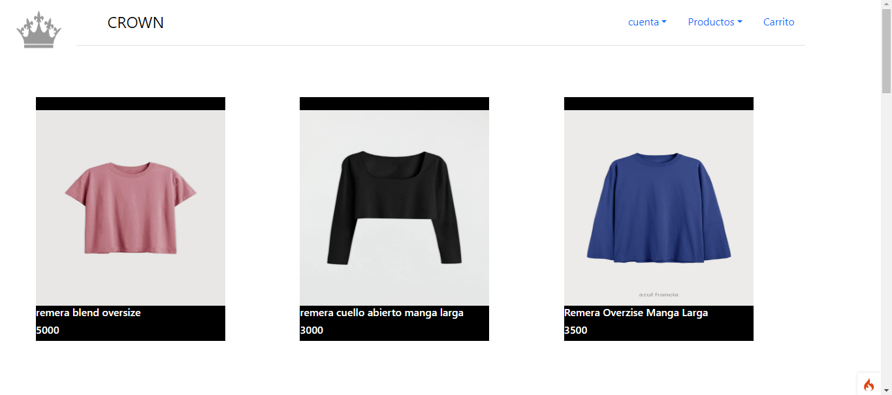

# crown

## Descripción
Nuestra idea para este trabajo en conjunto de las 3 materias de la especialidad (laboratorio de aplicaciones III, base de datos y laboratorio de programación). Es crear una página web la cual sirva para una marca de ropa llamada Crown.                                                                                                    La idea de esta página es que sea realmente práctica para que apenas la terminemos, ya esté en uso para que cualquier persona que quiera comprar ropa, pueda hacerlo en Crown.
El usuario lo primero que verá será para iniciar sesión o para registrarse si es que no tiene una cuenta. En el caso que se inicie sesión correctamente se lo mandara al inicio, en caso contrario este volverá al login hasta que se inicie correctamente.
En el inicio el usuario podrá ver la ropa recomendada o mas vendida, también se verá un encabezado que contenga remera, buzos, pantalones, una lupa y el carrito de compras.
Cuando el usuario ingrese a ver alguna prenda se mostrara el nombre de la prenda, el talle y el precio
El usuario podrá agregar todo lo que desea al carrito, para después confirmar su compra.
En el carrito se pedirán los datos personales para autorizar el envío del producto, también el pago se puede efectuar mediante paypal y transferencia bancaria.

## Capturas de Pantalla

## Tecnologías Utilizadas
- HTML
- CSS
- JavaScript
- PHP

## Estructura del Proyecto
- `/public`: Archivos públicos accesibles desde el navegador.
- `/src`: Código fuente del proyecto.
- `/docs`: Documentación adicional.

## Requisitos del Sistema
- Navegador web moderno (Chrome, Firefox, Safari, etc.).

## Créditos
- [Benjamin Grosso]
- [Enzo Carena]